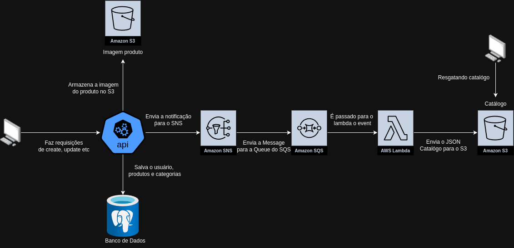

# Api cadastro de Catalogo (Java 🚀 com Spring Boot 🍃, AWS ☁️ e Postgres 🐘) 

Este é um projeto de **API REST** para um sistema de criação Produtos e Categorias para um catalógo, inspirado no desafio do Anota Ai. Api feita com o intuito de explorar as funcionalidades do AWS (S3, SNS, SQS e LAMBDA).

## Fluxo



## Tecnologias Utilizadas

- **Java 21**
- **Spring Boot 3**
- **PostgreSQL** (banco de dados relacional)
- **Swagger** (documentação da API)
- **AWS** (S3,SNS,SQS,LAMBDA)

## Funcionalidades

- **Registro de Categorias e Produtos**: Os usuários (Owner) podem criar novas categorias e produtos para elas.
- **Listagem de Produtos**: Os usuários (Owner) podem fazer a listagem das suas categorias e produtos.
- **Atualização de Produtos e Categorias**: Os usuários (Owner) podem atualizar seus categorias e produtos.
- **Exclusão de Produtos e Categorias**: Os usuários (Owner) podem excluir categorias e produtos 
  
## Pré-requisitos

- **Java 21**
- **Maven**
- **PostgreSQL** (banco de dados rodando localmente ou em container)
- **AWS** (S3,SNS,SQS,LAMBDA)


## Configuração do Projeto

1. Clone o repositório:

   ```bash
   git clone https://github.com/usuario/catalog-api-java-spring-aws.git
   cd catalog-api-java-spring-aws

2. Configure o banco de dados PostgreSQL. Altere as propriedades de conexão no arquivo application.properties:

      ```bash
   spring.datasource.url=
   spring.datasource.username=
   spring.datasource.password=

3. Configure o AWS S3 para upload de imagens, o arn do SNS, e as chaves de usuário IAM (É importante o usuário ter permissão de SQSFullAcess, SNSFullAcess e S3BucketFullAcess) arquivo application.properties

   ```bash
     aws.region=
    aws.accessKey=
    aws.secretKey=
    aws.bucket.name=
    aws.topic.arn=

4. Após criar os dois S3 um para o armazenamento do catálogo e outro para o armazenamento das imagens dos produtos, a assinatura do SNS com o SQS e criar o trigger do lambda no SQS, cole o código do lambdacode.mjs no codigo do lambda

5. Execute a aplicação:

      ```bash
   mvn spring-boot:run

## Documentação da API

A documentação da API é gerada automaticamente pelo Swagger e pode ser acessada através do seguinte link:

   http://localhost:8080/swagger-ui/index.html

## Endpoints Principais

POST endpoints:
- /category: Registra uma nova categoria.
- /product: Registra um novo produto.

GET endpoints:
- /category: Lista todas as categorias.
- /product: Lista todos os produtos.
  
PUT endpoints:
- /category/id: Atualiza uma categoria pelo Id.
- /product/id: Atualiza um produto pelo Id.

DELETE endpoints:
- /category/id: Remove uma categoria pelo Id.
- /product/id: Remove um produto pelo Id.
